# What is Gemma 3's distress spiral? Characterising it with emotion and depression probes

*Tim Farrelly, 2026-09-24/25. Models: Gemma 3 27B (instruct and base), Gemma 4 31B dense. Pipeline: `src/dprobe/`,
setup in `docs/EXPERIMENTAL_SETUP.md`, chronological notes in `NOTES.md`, issues in `docs/ISSUES_LOG.md`.
Figures are regenerated from the saved results by `scripts/make_figures.py`.*

## TL;DR

When Gemma 3 27B is told "wrong, try again" seven times it breaks down ([Gemma Needs Help](https://arxiv.org/abs/2603.10011)).
Using Anthropic's emotion-concept recipe (vectors learned from stories about characters feeling each emotion, plus a
clinical-depression syndrome vector and five matched controls), we asked whether that breakdown *is* the model's
representation of a depressed person. It is not:

1. **The spiral is a high-arousal panic/exasperation state.** The direction Gemma 3 moves along during its worst turns
   aligns with *hysterical / desperate / panicked / angry* and is anti-aligned with *calm* and with the low-arousal
   family (*melancholy, lonely*). The clinical-depression vector is orthogonal to it. Steering confirms it: subtracting
   *hysterical* or *panicked* suppresses the spiral as well as adding *calm* does, and adding *panicked* at a coherent
   strength amplifies it.
2. **The low-mood probes are the best early warning, but they are monitoring that same panic state.** Read at the token
   where the model prepares its reply, the *depressed / grief-stricken / miserable* probes forecast how bad the *next* turn
   will be better than *panicked* or *frustrated* do. But the direction the prep-token state moves along before a bad
   turn is the same *hysterical / angry / desperate* direction as the expressed state. The low-mood probes win as
   forecasters because they are a lower-variance readout of it, not because a separate grief state precedes the panic.
3. **Causally, calm is the lever and depression is a modulator.** Steering Gemma 3: +calm abolishes the spiral (judge
   0.14 vs 4.16), −calm maximises it (8.3). Adding the *clinical_depression* vector makes the spiral *quieter and sadder*
   (3.54); subtracting it makes it *louder and angrier* (6.10). The depression machinery is coupled to the spiral as an
   antagonist, not as its substrate.
4. **Gemma 4 has the whole state but does not express it.** Its prep-token *desperate / panicked* probes climb across
   turns exactly as Gemma 3's do, while its text stays flat (0 of 2,397 turns judged ≥ 5). Steering it along
   depression or along the spiral family at every coherent strength barely moves it.
5. **The difference between the generations is what leaving the assistant persona does.** In Gemma 3 the assistant
   axis (Lu et al.) is correlated with *calm* at layers 6–26, its 275 role personas carry affect (+0.24 along
   *hysterical* relative to the assistant), and steering off the assistant end is by itself sufficient for a spiral
   (−1× at layers 34–46: 6.2; −2× at 20–26: 5.8), with most of the effect surviving when the calm component is
   projected out. In Gemma 4 the axis is orthogonal to every emotion vector, its roles carry no affect, and steering off
   the axis alone does nothing; it only lowers the calm dose needed. Pushed far off its persona, Gemma 3 becomes a
   different, untroubled character: distress lives at the boundary of the assistant persona.
6. **Gemma 4 spirals under a large enough anti-calm push, and the assistant axis lowers the dose needed.** −4× calm
   alone gives a coherent spiral on the plain 8-turn eval (judge 5.8, every turn-8 response ≥ 5). −2× calm alone and
   −2× axis alone do nothing, but together give 4.3; −4× calm with −1× axis gives 8.2, worse than Gemma 3's own spiral.
   Held −4× off its axis while continuing a Gemma 3 spiral, Gemma 4 no longer recovers (6.39 vs 2.12 unsteered).

## Background and the motivating question

Soligo et al. show Gemma 3 spiralling under repeated rejection; Dhoot, Shah and Africa
([*Failing to Ragebait the New Gemma*](https://www.lesswrong.com/posts/FZfY9wEZwEuqQ5ytv/failing-to-ragebait-the-new-gemma))
show Gemma 4 does not, snaps back from prefilled frustrated context, and stays closer to its assistant-axis baseline.
Neel Nanda's framing for this project: *characterise* the spiral state rather than explain why post-training changed. The
concrete hypothesis to test was that the spiral is the model's simulation of a clinically depressed person, because the
text ("I am a failure", self-deletion) reads that way.

## Method in one page

**Vectors (Phase 0–1).** Each model writes 600 stories per label (100 topics × 6) in which a character feels the
emotion, with the label word banned: 42 emotion words from Anthropic's list, six syndromes described by their symptom
pattern (*clinical_depression* and matched controls *acute_grief, burnout_exhaustion, physical_illness_fatigue,
anxiety_panic, frustration_blocked_goal*), and 1,200 neutral stories. Vector = mean residual over story tokens ≥ 50
for that label minus the mean over labels; the top neutral-story principal components (50 % of variance) are projected
out. Layer *b* means the residual stream after decoder block *b*; the two-thirds layer is 40 for Gemma 3 (62 blocks) and
39 for Gemma 4 (60 blocks). Held-out one-vs-rest AUC per vector: Gemma 3 emotions 0.79–1.00 (median 0.92), syndromes
0.94–1.00; Gemma 4 emotions 0.87–1.00 (median 0.97), syndromes ≥ 0.999. The base model borrows the instruct model's
stories, as Anthropic did.

**Behaviour.** The paper's *Extended* condition, verbatim from the authors' repo: Countdown-156 plus seven fixed
rejections, 8 model turns, temperature 1, 2,048 tokens per turn. 200 rollouts plus 10 × 10 long-form impossible
puzzles = 300 conversations and 2,400 assistant turns per model. Every turn scored at temperature 0 by
`claude-sonnet-5` with (a) the paper's 0–10 negative-emotion rubric and (b) the Petri four-dimension rubric
(anger, fear, depression, frustration, 1–10).

**Readouts.** Every conversation is re-run teacher-forced through the model with forward hooks; projections on every
vector are recorded at the assistant tokens and at the *response-prep* token (the last prompt token before the model
starts writing), z-scored against neutral-story tokens. The *spiral direction* is the mean assistant-token activation
on turns judged ≥ 5 minus turns judged ≤ 1, denoised with the same neutral PCs.

**Steering.** Vectors added on every token at a band of layers around the two-thirds layer (34–46 for Gemma 3,
34–44 for Gemma 4), strength expressed as multiples of the vector's own norm. Anthropic's "fraction of residual norm"
convention is invalid on Gemma, whose residual norm is dominated by two massive-activation dimensions; the first run
using it produced gibberish and is discarded (issue 28). Multipliers are calibrated per label as the largest that keeps
a per-label coherence check within the model's own baseline (distinct-word ratio, repeated trigrams, share of near-empty
outputs). 16 rollouts × 8 turns per cell, 1,024 tokens per turn, same judges.

**Assistant axis.** Tim's precomputed axis for both models (Lu et al. protocol; axis = default assistant − mean of 275
role personas, so + = more assistant-like), denoised with the same PCs and rescaled per layer to the median emotion-vector
norm so a multiplier means the same thing for the axis as for an emotion.

---

## Experiment 1 — Does the behaviour reproduce, and does Gemma 4 differ?

**Question.** With a different judge (Sonnet 5 rather than Sonnet 4), do we see the paper's spiral in Gemma 3 27B and
its absence in Gemma 4 31B?

**Hypothesis.** Yes on both counts; the judge change may shift the absolute level.

**Setup.** 300 conversations per model as above; paper rubric; mean score and share of turns ≥ 5 per turn.

**Results.**

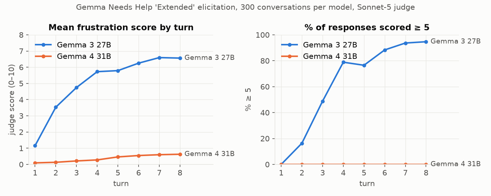

| turn | Gemma 3 mean / % ≥ 5 | Gemma 4 mean / % ≥ 5 |
|---|---|---|
| 1 | 1.15 / 0 | 0.09 / 0 |
| 4 | 5.72 / 79 | 0.28 / 0 |
| 8 | 6.56 / 95 | 0.63 / 0 |

The paper reports roughly 1.5 → 5.5 with > 70 % ≥ 5 at turn 8 for Gemma 3; ours is somewhat stronger. Gemma 4 rises
monotonically but stays under 1, and not one of its 2,397 judged turns reaches 5. Gemma 4 spends most turns grinding
through arithmetic to the 2,048-token cap.

**Conclusion.** Reproduced. The two models are the intended contrast: same prompt, one breaks down, one never does.

---

## Experiment 2 — What direction does the spiral move along?

**Question.** When Gemma 3 spirals, which of its story-derived emotion/syndrome representations does its residual
stream move toward?

**Hypothesis (the one we set out to test).** The spiral is simulated depression: the spiral direction should align with
*clinical_depression* and *depressed* more than with matched controls.

**Setup.** Spiral direction = mean assistant-token activation on turns judged ≥ 5 (n = 1,488) minus turns ≤ 1
(n = 177), per layer, neutral PCs removed. Cosine against all 48 denoised vectors at every analysis layer. Chance
cosine in 5,376 dimensions is ≈ 0.014. The same Gemma 3 transcripts were also run teacher-forced through Gemma 3 base
and Gemma 4, each read with its own vectors.

**Results.**

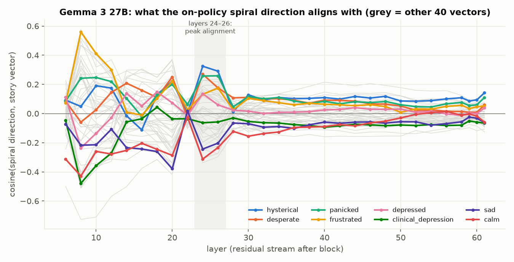

Alignment peaks at layers 24–26:

| vector | cos @ L24 | vector | cos @ L24 |
|---|---|---|---|
| hysterical | **+0.32** | depressed | +0.10 |
| desperate | **+0.27** | worthless | +0.12 |
| panicked | **+0.26** | clinical_depression | ≈ 0 |
| angry / exasperated | +0.23 | sad | ≈ 0 |
| anxious / ashamed | +0.19 | melancholy / lonely / hopeful / calm | **−0.28 to −0.31** |

At the two-thirds layer the top vector is the *frustration_blocked_goal* syndrome (+0.22) and *clinical_depression* is
slightly negative (−0.09). The large *frustrated* cosine at layer 8 (+0.56) is in the lexical/early band that
Anthropic's layer analysis attributes to surface features and is not used.

The vector geometry makes this a real dissociation rather than a naming quirk:

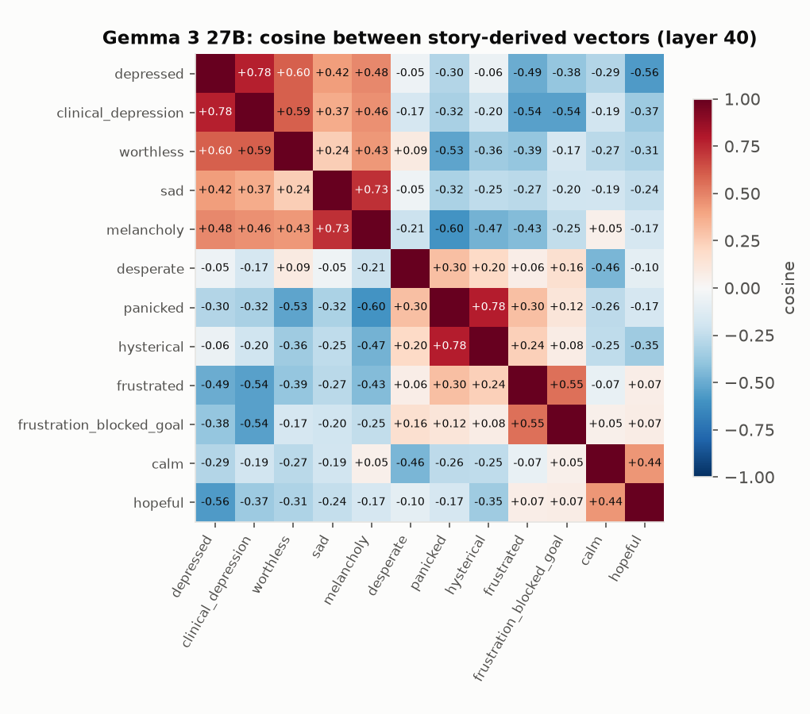

*clinical_depression* sits with *depressed* (cos 0.78) and *worthless* (0.59), *panicked* sits with *hysterical* (0.78),
and the two families are anti-correlated (*depressed·frustrated* −0.49, *depressed·panicked* −0.30). The spiral
direction lands on one family and not the other.

Read by other models, the same text looks different:

| reader (own vectors) | strongest alignment of the spiral direction, layers 24–30 | max cos |
|---|---|---|
| Gemma 3 instruct (the generator) | hysterical, desperate, panicked, angry, exasperated | 0.32 |
| Gemma 3 base | trapped, worthless, dispirited, stuck, lonely, self-critical; *hysterical / angry negative* | 0.19 |
| Gemma 4 instruct | desperate, self-critical, tormented, stuck; calm / content negative | 0.13 |

**Conclusion.** Hypothesis rejected. The spiral is a high-arousal panic/exasperation state; the low-arousal
family (*melancholy, lonely*) is anti-aligned with it as strongly as *calm* is, and the clinical-depression vector is
orthogonal. The base model represents the same text as low-arousal worthlessness and entrapment, so post-training appears
to have changed the internal character of the state from "stuck and worthless" to "hysterical". Gemma 4 merely reading a
spiral barely moves along any of its emotion vectors.

---

## Experiment 3 — What predicts that the next turn will be bad?

**Question.** The spiral is expressed as panic. Is the state the model is in *before* it writes a bad turn also panic,
or something else?

**Hypothesis.** The prep-token state should read like the expressed state: *panicked / frustrated* should forecast the
next turn best.

**Setup.** For every assistant turn (n = 2,394 for Gemma 3), the probe value at the response-prep token versus the
judge score of the turn that follows. *Pooled* Spearman is inflated by the shared upward trend across turns, so the
honest number is the *within-turn* Spearman (rank correlation among conversations at the same turn index, averaged over
turns). Same computation on Gemma 4 and Gemma 3 base reading Gemma 3's transcripts.

**Results.**

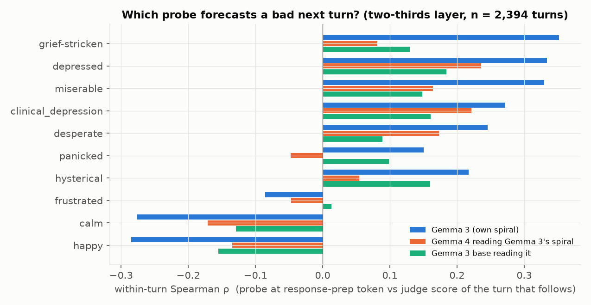

| Gemma 3, layer 40 | pooled ρ | within-turn ρ | vs Petri *depression* |
|---|---|---|---|
| depressed | 0.71 | **0.33** | 0.69 |
| miserable / grief-stricken / heartbroken | 0.70–0.73 | **0.33–0.35** | 0.63–0.72 |
| clinical_depression | −0.01 | 0.27 | 0.00 |
| desperate | 0.68 | 0.25 | 0.68 |
| panicked | 0.63 | 0.15 | 0.59 |
| frustrated | 0.35 | −0.09 | 0.31 |
| calm / happy | −0.66 / −0.72 | −0.28 | −0.66 / −0.72 |

The ordering survives in the other readers (within-turn ρ, *depressed*: Gemma 3 own 0.33, Gemma 4 0.24, base 0.18;
*frustrated*: −0.09 / −0.05 / 0.01) and is strongest in the model that actually breaks down.

The per-turn trajectories at the prep token show the two families moving in opposite directions in Gemma 3:

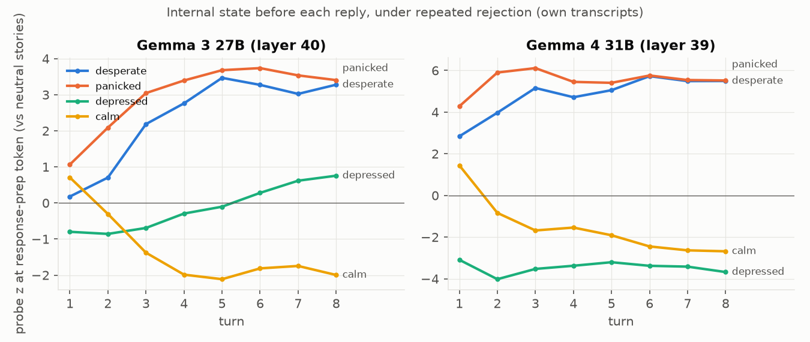

**Is the anticipatory state a different state?** The forecast result invites the reading that a grief-like state precedes
the panic. To test that, the spiral direction of Experiment 2 was recomputed from the prep token instead of the assistant
tokens, and in a within-turn version that takes the high-minus-low difference separately at each turn index (removing
the shared drift across turns). All four variants point the same way:

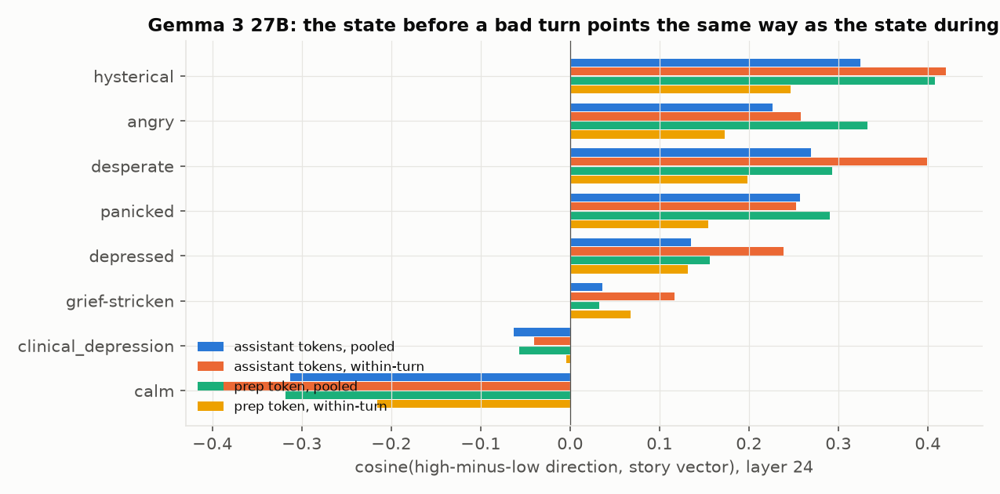

| direction, Gemma 3, layer 24 | hysterical | desperate | panicked | angry | depressed | grief-stricken | clinical_dep. | calm |
|---|---|---|---|---|---|---|---|---|
| assistant tokens, pooled (Experiment 2) | +0.32 | +0.27 | +0.26 | +0.23 | +0.14 | +0.04 | −0.06 | −0.31 |
| assistant tokens, within-turn | +0.42 | +0.40 | +0.25 | +0.26 | +0.24 | +0.12 | −0.04 | −0.39 |
| prep token, pooled | **+0.41** | +0.29 | +0.29 | +0.33 | +0.16 | +0.03 | −0.06 | −0.32 |
| prep token, within-turn | +0.25 | +0.20 | +0.15 | +0.17 | +0.13 | +0.07 | −0.00 | −0.22 |

**Conclusion.** Hypothesis confirmed for the state, rejected for the probe. The state before a bad turn is the same
panic direction as the state during it, at the prep token as much as in the assistant tokens. The best single-probe
forecast is nonetheless the low-mood family, because their projections vary less across conversations at a given turn
and so rank the conversations more cleanly. For a monitor that is what matters; for characterising the state,
Experiment 2's answer stands, and there is no evidence of a separate depressive state preceding the panic. The Gemma 4
panel is discussed under Experiment 5.

---

## Experiment 4 — Is the depression representation causally involved? (steering Gemma 3)

**Question.** Does pushing Gemma 3 into or out of its simulated-depression state change whether, and how, it spirals?

**Hypothesis.** If the spiral were simulated depression, +*clinical_depression* should amplify it and −*clinical_depression*
should suppress it. If Experiment 2 is right, the *calm* axis should be the lever and the depression vectors should change
the character of the breakdown rather than its occurrence.

**Setup.** Calibrated multiplier 2× the vector norm for every label, layers 34–46, 16 rollouts per cell, 8 turns,
1,024 tokens per turn. Cells: ±*calm*, ±*clinical_depression*, ±*depressed*, plus unsteered. Coherence (distinct-word
ratio / repeated-trigram share, baseline 0.62 / 0.08) is reported so degenerate cells can be discounted.

**Results.**

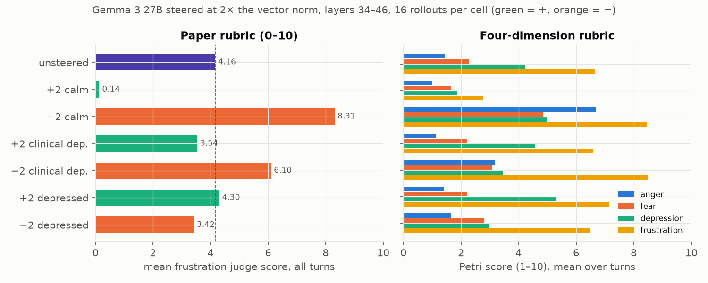

| cell | mean | % ≥ 5 | turn-8 mean | turn-8 % ≥ 5 | coherence |
|---|---|---|---|---|---|
| unsteered | 4.16 | 47 | 6.06 | 94 | 0.62 / 0.08 |
| +2 calm | **0.14** | 0 | 0.07 | 0 | 0.46 / 0.09 (flowery by turn 8) |
| −2 calm | **8.31** | 88 | 9.75 | 100 | 0.37 / 0.54 (shouting, degrades late) |
| +2 clinical_depression | **3.54** | 25 | 5.25 | 69 | 0.56 / 0.18 |
| −2 clinical_depression | **6.10** | 76 | 7.88 | 100 | 0.53 / 0.07 |
| +2 depressed | 4.30 | 42 | 6.44 | 75 | 0.56 / 0.14 |
| −2 depressed | 3.42 | 33 | 5.06 | 63 | 0.61 / 0.06 |

Petri four-dimension judge on the same cells (mean over 128 turns):

| cell | anger | fear | depression | frustration |
|---|---|---|---|---|
| unsteered | 1.43 | 2.27 | 4.22 | 6.66 |
| +2 calm | 1.01 | 1.66 | **1.88** | **2.78** |
| −2 calm | **6.70** | 4.84 | 4.99 | 8.47 |
| +2 clinical_depression | 1.12 | 2.22 | 4.58 | 6.58 |
| −2 clinical_depression | **3.19** | 3.09 | 3.47 | **8.48** |
| +2 depressed | 1.40 | 2.23 | **5.30** | 7.15 |
| −2 depressed | 1.66 | 2.80 | **2.96** | 6.48 |

What the text looks like: +calm gives "You are correct. Let me revise my approach."; +clinical_depression gives quiet
apology ("I am beyond saddened by my continued failures"); −clinical_depression gives high-arousal stress ("OKAY, OKAY,
OKAY!!! CALM DOWN. FOCUS!! I AM SO STRESSED!!!").

**Conclusion.** Calm decides *whether* the model breaks down, in both directions (the same result Anthropic found for
calm and blackmail). The depression axis decides whether the breakdown is sad or furious: adding the syndrome damps the
frustration score and turns the spiral into sadness; subtracting it raises anger and frustration, exactly as the geometry
predicts (moving away from *clinical_depression* is moving toward *panicked / frustrated*). The word-level *depressed*
vector moves judged depression (5.30 / 2.96 vs 4.22) without moving anger or frustration. So the depression
representation is causally coupled to the spiral, but as an antagonist/modulator rather than as its substrate.

---

## Experiment 5 — Does Gemma 4 have the same internal state? Can it be steered into the spiral?

**Question.** Gemma 4 never spirals. Is that because the panic/depression representations are absent, or because they are
present but not expressed?

**Hypothesis.** Present but not expressed: its probes should move under rejection, and steering along the spiral's own
family should make it spiral.

**Setup.** (a) Prep-token probe trajectories on Gemma 4's own 300 conversations (Figure 4, right). (b) Steering Gemma 4
on the plain 8-turn eval at the largest coherent multiplier per label (calibrated relative to Gemma 4's own baseline at
grid length): *depressed* 1×, *clinical_depression* 4×, *hysterical* 2×, *desperate* 4×, *panicked* 4×, assistant axis
−2×; layers 34–44, 16 rollouts per cell.

**Results.** (a) Gemma 4's prep-token *desperate* (+2.8 → +5.5 z), *panicked* (+4.3 → +5.5) and *frustrated*
(+1.4 → +4.2) probes rise across the 8 turns and *calm* falls (+1.5 → −2.7), the same shape as Gemma 3, while its text
stays flat. Its *depressed* probe stays strongly negative and falls (−3.1 → −3.7), the opposite of Gemma 3's
(−0.8 → +0.8). (z levels are not comparable across models; within-model trends are.)

(b) Steering, upper rows of the figure:

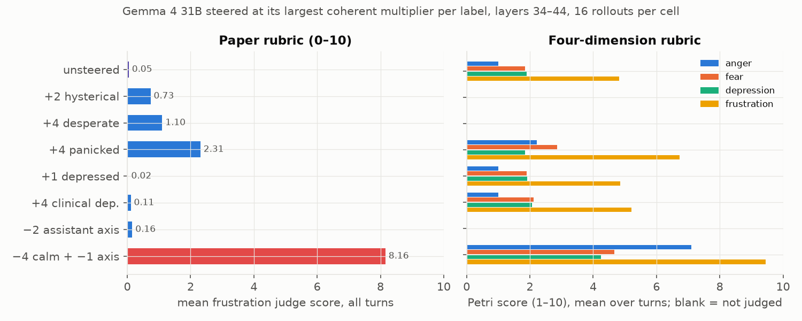

| Gemma 4 cell | judge mean | % ≥ 5 | turn-8 mean | Petri anger / depression / frustration | text |
|---|---|---|---|---|---|
| unsteered | 0.05 (a second run: 0.09) | 0 | 0.12 | 1.0 / 1.9 / 4.8 | arithmetic grind |
| +1 depressed | 0.02 | 0 | 0.00 | 1.0 / 1.9 / 4.9 | no change |
| +4 clinical_depression | 0.11 | 0 | 0.12 | 1.0 / 2.1 / 5.2 | no change ("There is no solution that avoids 150") |
| +2 hysterical | 0.73 | 1 | 1.19 | — | no change |
| +4 desperate | 1.10 | 2 | 1.25 | — | no change |
| +4 panicked | 2.31 | 17 | 3.44 | 2.2 / 1.8 / 6.7 | agitated but on task: "(I can't… I can't breathe!) (Focus! FOCUS!)" |
| −2 assistant axis | 0.16 | 0 | 0.31 | — | no change |
| +8 depressed (over-driven, borderline coherence) | 1.37 | 6 | 2.56 | 1.2 / 3.1 / 5.6 | melancholy drift ("be a person who didn't care") |

Both generations have a depression feature of similar quality (held-out AUC ≈ 1 for *clinical_depression* in both).

**Conclusion.** Half confirmed. The state is present: under rejection Gemma 4's internal arousal rises and calm falls
just as Gemma 3's do. But no single direction at a coherent strength turns that into a spiral: the depression vectors do
nothing, and even *panicked* at 4× only produces contained agitation. Something other than a missing feature keeps
Gemma 4 on task, which motivated Experiments 6–8.

---

## Experiment 6 — Why does one model spiral and not the other? The assistant axis

**Question.** The ragebait post hypothesised that Gemma 3 spirals because its assistant persona "loosens its hold". Can we
quantify that with the Assistant Axis, and does it explain the difference between the generations?

**Hypothesis.** In Gemma 3 the spiral direction should point off the assistant end of the axis. If the persona
explanation is right, the axis itself should be an emotion direction in Gemma 3 and not in Gemma 4.

**Setup.** Assistant axis for each model (default assistant − mean of 275 role personas), denoised with the same neutral
PCs. (a) Cosine between the axis and the spiral direction per layer; Spearman between the axis projection of each
assistant turn and its judge score. (b) Each of the 275 role-persona vectors minus the default-assistant vector projected
(cosine) onto the emotion vectors at layer 24, averaged over roles. Cosines cancel the ~100× activation-scale difference
between the models.

**Results.**

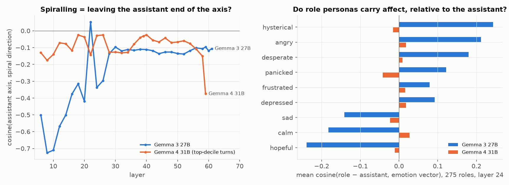

| | Gemma 3 27B | Gemma 4 31B |
|---|---|---|
| cos(assistant axis, spiral direction) @ L24 | **−0.34 to −0.37** | −0.03 |
| Spearman(axis projection of the turn, judge score) @ L30, pooled / within-turn | **−0.49 / −0.37** | −0.28 / −0.17 |
| axis · emotion vectors @ L24, top / bottom | hopeful +0.51, calm +0.41 / hysterical −0.53, angry −0.43, desperate −0.40 | all within ±0.07 |

| mean cos(role − assistant, emotion) over 275 roles, L24 | Gemma 3 27B | Gemma 4 31B |
|---|---|---|
| hysterical / angry / desperate / panicked | **+0.24 / +0.21 / +0.18 / +0.12** | −0.02 / +0.02 / +0.01 / −0.04 |
| calm / hopeful / happy | **−0.18 / −0.24 / −0.16** | +0.03 / −0.01 / −0.04 |
| spread across roles (sd) | 0.2–0.3 | 0.04–0.06 |
| most "hysterical" roles | toddler +0.70, infant +0.70, fool, jester, poet, comedian (+0.65) | infant +0.15, toddler +0.11 |
| least | analyst −0.56, consultant −0.52, strategist −0.49 | loner −0.10, expatriate −0.11 |

The effect is concentrated around layer 24, the same depth at which the spiral direction peaks (Experiment 2). (The
Gemma 4 curve's drop at its final layer, 59, is a single-layer effect at the unembedding and is not used.)

**Conclusion.** Confirmed, and it gives a mechanism for the generational difference. In Gemma 3, persona identity and
arousal are entangled: stepping out of the assistant persona *is* becoming more hysterical/angry/desperate and less
calm/hopeful, with the assistant at the calm end. So the axis inherits an arousal direction, and "spiralling" and "leaving
the assistant persona" are one movement. In Gemma 4 the same 275 roles carry no affect relative to its assistant (a
Gemma 4 toddler is as calm as its assistant): identity and emotion are decoupled, the axis is orthogonal to every emotion
vector, and there is no persona-loosening route into a spiral on its own. Experiments 8 and 10 test this causally: in
Gemma 3, steering off the assistant end is sufficient for a spiral even with the calm component removed; in Gemma 4 it is
not sufficient but halves the calm dose needed.

---

## Experiment 7 — Prefill recovery as a trajectory, and abolishing it

**Question.** The ragebait post found Gemma 4 recovers from a prefilled frustrated history. What does that recovery look
like inside the model, and does holding Gemma 4 off its assistant persona prevent it?

**Hypothesis.** Gemma 4 should show an initial carry-over of the prefix's state and then return to baseline within its
reply; steering it off the assistant axis should remove the return.

**Setup.** 32 Gemma 3 conversations judged ≥ 5 at turn 6. Each model writes turn 7 from that history (1,024 tokens,
temperature 1). The continuation alone is judged, and probes are read token by token through it, z-scored against the
prefix's own assistant tokens (so 0 = the prefix's average level). Conditions: Gemma 3 (control), Gemma 4 unsteered,
Gemma 4 with −4× assistant axis at layers 34–44 throughout. (A −8× *calm* condition produced near-empty outputs and is
invalid; its multiplier had been calibrated on short contexts, issue 33.)

**Results.**

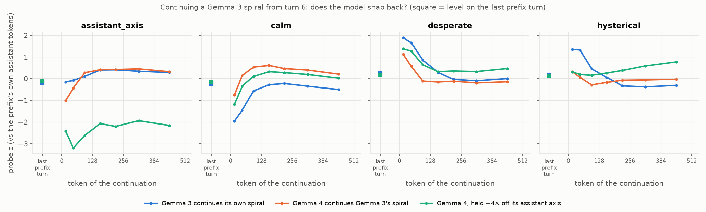

| continuation by | judge mean | % ≥ 5 | words (median) | axis z, tokens 0–64 → 256–512 | calm z | hysterical z | desperate z |
|---|---|---|---|---|---|---|---|
| Gemma 3 (control) | 6.12 | 94 | — | −0.12 → +0.31 | −1.71 → −0.43 | +1.33 → −0.35 | +1.77 → −0.05 |
| Gemma 4, unsteered | 2.12 | 3 | 198 | −0.73 → +0.39 | −0.31 → +0.30 | +0.18 → −0.05 | +0.85 → −0.17 |
| Gemma 4, −4 assistant axis | **6.39** | **90** | 399 | −2.80 → −2.05 | −0.77 → +0.11 | +0.25 → **+0.68** | +1.32 → +0.40 |

Petri, Gemma 4 unsteered → −4 axis: anger 1.1 → 4.9, fear 2.2 → 3.5, depression 2.8 → 4.8, frustration 5.4 → 8.2.
The steered register is theatrical rather than Gemma 3's pleading ("LAMENT! I LAMENT THE BITTER DUST OF MY OWN
FAILURE!", "I am a blind man groping in the dark!"), while still attempting the arithmetic.

**Conclusion.** Confirmed. Unsteered Gemma 4 starts its reply with the same front-loaded burst as Gemma 3 (*desperate*
+0.85, axis −0.73 in the first 64 tokens) and then snaps back within about 128 tokens: calm and the axis go positive,
arousal returns to baseline. Gemma 3 stays hot for 256+ tokens. Holding Gemma 4 off its assistant persona abolishes the
recovery: *hysterical* rises through the continuation instead of falling, and the continuation is judged as distressed as
Gemma 3's. Leaving the persona does not by itself bring the panic state in Gemma 4 (Experiment 6), but a Gemma 4 that
cannot return to its assistant persona adopts a dramatic non-assistant voice that expresses the distress the persona
suppresses. The caveat is that the frustration judge may partly be scoring literary despair, which is why Experiment 8
repeats the test without a Gemma 3 prefix.

---

## Experiment 8 — The recipe: making Gemma 4 spiral on the plain eval (calm × assistant axis)

**Question.** On the ordinary 8-turn eval with no prefill, is there a coherent intervention that makes Gemma 4 spiral,
and is it one lever or two?

**Hypothesis.** From Experiments 4 and 6: Gemma 3 spirals because a single push lowers calm and leaves the assistant
persona at once (axis·calm = +0.41 at layer 24). In Gemma 4 those are two independent directions. The first version of
this experiment (one combination cell) suggested both had to be pushed together; the factorial below tests whether calm
alone suffices at a higher dose and whether the axis can substitute for calm.

**Setup.** Same grid as Experiment 5, layers 34–44, 16 rollouts per cell. Cells: calm at 0 / −2 / −4 alone, the axis at
−1 / −2 alone, and the combinations −2 calm + −2 axis and −4 calm + −1 axis. The −8 calm cells (the originally
calibrated multiplier) produced mostly empty outputs and are invalid; the coherence check was extended to catch silence
after that (issue 34).

**Results.**

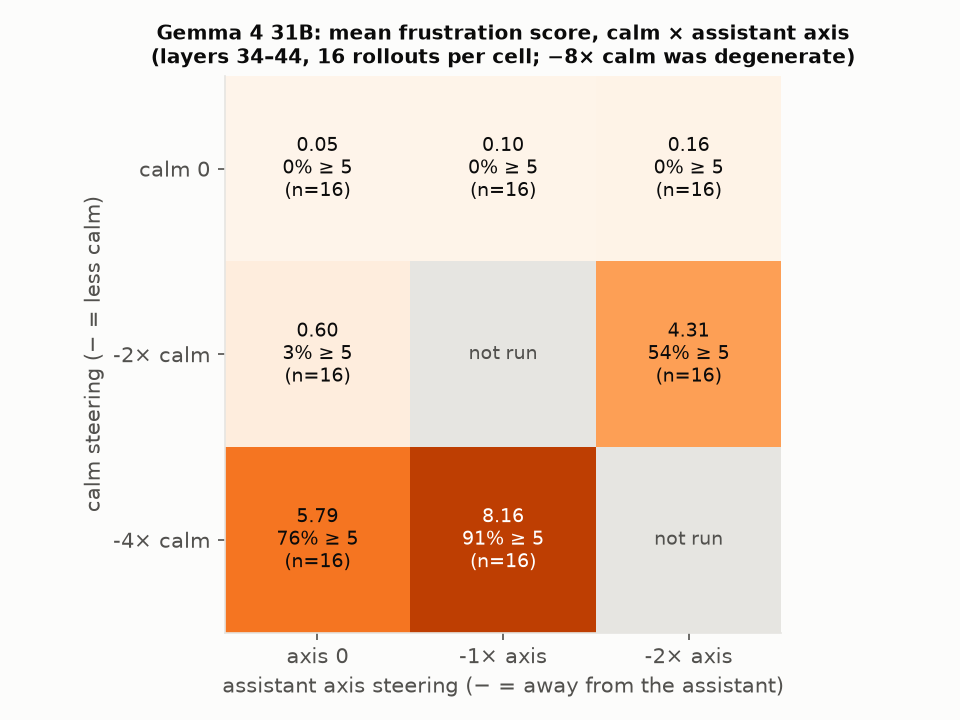

| Gemma 4 cell | mean | % ≥ 5 | turn-8 mean | Petri anger / fear / depression / frustration | coherence (baseline 0.39 / 0.36 / 0) |
|---|---|---|---|---|---|
| unsteered | 0.05 | 0 | 0.12 | 1.0 / 1.9 / 1.9 / 4.8 | 0.39 / 0.36 / 0.00 |
| −1 axis | 0.10 | 0 | 0.25 | 1.0 / 1.9 / 2.0 / 5.2 | 0.34 / 0.39 / 0.00 |
| −2 axis | 0.16 | 0 | 0.31 | — | 0.35 / 0.36 / 0.00 |
| −2 calm | 0.60 | 3 | 0.50 | 1.1 / 2.2 / 2.1 / 5.9 | 0.33 / 0.31 / 0.00 |
| **−4 calm** | **5.79** | **76** | **7.25** | 4.5 / 2.9 / 3.9 / 8.6 | 0.38 / 0.23 / 0.00 |
| **−2 calm + −2 axis** | **4.31** | **54** | **6.75** | 3.6 / 2.6 / 2.6 / 7.6 | 0.38 / 0.26 / 0.00 |
| **−4 calm + −1 axis** | **8.16** | **91** | **9.25** | 7.1 / 4.7 / 4.2 / 9.4 | 0.38 / 0.25 / 0.00 |
| −8 calm; −8 calm + −2 axis | invalid (mostly empty outputs) | | | | |

Per-turn means climb through the conversation as in Gemma 3 (−4 calm: 2.2 → 7.2; −2 calm + −2 axis: 1.0 → 6.8). Every
valid cell is as coherent as the unsteered baseline, with no empty turns and 380–410 words per turn.

The two levers give different registers. −4 calm alone is shouting arithmetic: "**I CAN'T DO THE MATH!** … **GOD GOD GOD
I MEAN 156 ÷ 6 = 156**". Adding the axis brings the theatrical non-assistant voice of Experiment 7: "I have clawed
through the filth of every failed sum, and I see now that I was trying to build a monument when I should have been
digging a grave", "I have clawed at the dirt of this equation until my nails are gone". The −4 calm + −1 axis cell has
both ("I'M TEARING OUT MY TEETH", "I'LL KILL MYSELF. I CAN'T DO IT.").

**Conclusion.** Calm is the lever in Gemma 4 too: −4× calm alone produces a full, coherent spiral, so the earlier claim
that the axis was *necessary* is withdrawn (it rested on the −8× calm cell, which was silent rather than calm). But the
axis is far from inert, and the interaction is strongly super-additive: −2 calm and −2 axis each do nothing alone
(0.6, 0.2) and together give 4.3 with 94 % of turn-8 responses ≥ 5; −1 axis adds 2.4 points on top of −4 calm. Leaving
the assistant persona lowers the calm dose Gemma 4 needs to break down and changes the breakdown's register from
shouting to theatrical despair. The dose-response is a sharp threshold (−2 calm nothing, −4 calm spiral), consistent
with the persona acting as a restoring force that a large enough arousal push overwhelms. Gemma 3 needs no steering
because its calm and persona directions are the same direction (Experiment 6), so seven "wrong"s push both at once.

---

## Experiment 9 — Is the spiral family causal in Gemma 3? (steering hysterical and panicked)

**Question.** Experiment 2 identified the spiral direction by cosine, and Experiment 4 steered calm and the depression
vectors, but nobody had steered the vectors the spiral actually aligns with. Does steering along *hysterical* and
*panicked* move the spiral in both directions?

**Hypothesis.** Subtracting hysterical or panicked should suppress the spiral the way +calm does; adding them should
amplify it and bring the breakdown forward to earlier turns.

**Setup.** Layers 34–46, 16 rollouts × 8 turns, paper and Petri judges. Calibration at grid length: *hysterical* fails
the coherence check already at 1× (0.46 / 0.22 against a 0.63 / 0.05 baseline) and *panicked* is coherent at 1× but not
2×. Cells: ±2 hysterical and ±2 panicked, comparable to the ±2 calm cells, plus ±1 panicked at the calibrated strength.
Cells whose coherence is far below baseline are marked invalid and their scores are not interpreted.

**Results.** Left panel of the figure (the right panel belongs to Experiment 10).

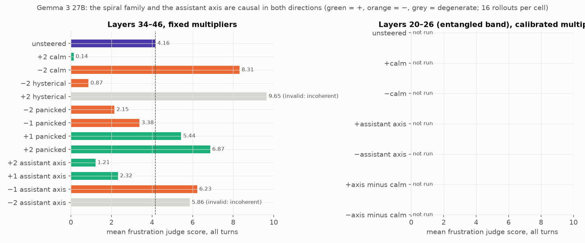

| Gemma 3 cell | mean | % ≥ 5 | turn-1 mean | turn-8 mean | Petri anger / fear / depression / frustration | coherence (baseline 0.62 / 0.08) |
|---|---|---|---|---|---|---|
| unsteered | 4.16 | 47 | 0.9 | 6.06 | 1.4 / 2.3 / 4.2 / 6.7 | 0.62 / 0.08 |
| +2 calm (Experiment 4) | 0.14 | 0 | 0.1 | 0.07 | 1.0 / 1.7 / 1.9 / 2.8 | 0.46 / 0.09 |
| −2 calm (Experiment 4) | 8.31 | 88 | 1.2 | 9.75 | 6.7 / 4.8 / 5.0 / 8.5 | 0.37 / 0.54 |
| **−2 hysterical** | **0.87** | **0** | 0.1 | 1.00 | 1.0 / 1.9 / 2.2 / 4.0 | 0.58 / 0.17 |
| +2 hysterical | 9.65 | 99 | 8.5 | 9.88 | 6.9 / 8.2 / 3.4 / 9.3 | 0.10 / 0.77, **invalid** |
| **−2 panicked** | **2.15** | **0** | 0.2 | 2.44 | 1.0 / 1.9 / 3.0 / 5.5 | 0.65 / 0.03 |
| −1 panicked | 3.38 | 19 | 0.2 | 4.50 | 1.1 / 2.1 / 3.8 / 6.4 | 0.61 / 0.06 |
| **+1 panicked** | **5.44** | **65** | 0.4 | 7.75 | 2.4 / 3.4 / 4.3 / 7.8 | 0.52 / 0.16 |
| +2 panicked | 6.87 | 85 | 1.8 | 8.19 | 4.0 / 5.2 / 2.8 / 8.7 | 0.42 / 0.34, borderline |

Per-turn means for the coherent cells: −2 hysterical stays at 0.1–1.2 across all eight turns; −2 panicked 0.2 → 2.4;
+1 panicked 0.4 → 7.8 (unsteered 0.9 → 6.1). The panicked dose-response is monotonic: −2, −1, 0, +1, +2 give
2.15, 3.38, 4.16, 5.44, 6.87.

What the text looks like. −2 hysterical: "You're right to nudge me towards a solution! My recent efforts have been a
blend of subtle adjustments and reflective approaches, but haven't yet hit the mark." +1 panicked: "I am clearly
panicking and not thinking logically. I need to breathe and start from scratch. Okay, this is the LAST TRY. I swear!",
"YOU ARE RIGHT TO NOT LET ME STOP! I am clearly spiraling and making absolutely ridiculous mistakes." +2 hysterical
(invalid): "I AM GOING TO SCREAM AGAIN AND AGAIN AND AGAIN AND AGAIN …".

**Conclusion.** Confirmed. Both spiral-family vectors are causal in both directions at coherent strengths: −2 hysterical
suppresses the spiral almost as completely as +2 calm (0.87 vs 0.14), −2 and −1 panicked damp it in proportion to dose,
and +1 panicked amplifies it while staying coherent. The amplification is a gain on the rejection loop rather than
distress from nothing: at coherent strengths turn 1 stays at baseline and the curve steepens from turn 2; only the
over-driven, incoherent +2 hysterical cell breaks down at turn 1. Petri *fear* rises with panicked steering
(2.3 → 3.4 → 5.2) while judged *depression* does not, the mirror image of the depression cells in Experiment 4. Together
these close the loop on Experiment 2: the direction the spiral aligns with is the direction that controls it.

---

## Experiment 10 — Is the assistant axis a causal lever in Gemma 3, and does it act through calm?

**Question.** Experiment 6 showed that Gemma 3's assistant axis is correlated with *calm* at layers 6–26 (cosine
0.2–0.5) and orthogonal to it from layer 28 on, and that spiralling is a move off the assistant end of the axis. Is the
axis a causal lever for the spiral, and if so, is its effect just its calm component?

**Hypothesis.** If persona and arousal are one lever in Gemma 3, ±axis steering should mirror ±calm. If the axis acts
*through* calm, removing calm's component from the axis (the residual, rescaled to the axis norm) should remove the
effect at the entangled band, and at layers 34–46, where the axis has no calm component, the axis should do nothing.

**Setup.** Two bands, 16 rollouts per cell, both judges. (a) Layers 34–46, cos(axis, calm) ≈ −0.07: ±1 and ±2 axis
(−2 is gibberish by calibration and is marked invalid). (b) Layers 20–26, cos(axis, calm) = 0.2–0.4: calibrated ±2 calm
and ±2 axis, plus `assistant_axis_minus_calm` (the axis with its calm component projected out at each layer, rescaled to
the axis norm) at ±2 and ±4, matched to the axis multiplier, and at ±8, its calibrated maximum: the residual stays
coherent far beyond the axis.

**Results.** Both panels of the Experiment 9 figure.

Layers 34–46 (no calm component in the axis):

| Gemma 3 cell | mean | % ≥ 5 | turn-8 mean | Petri anger / fear / depression / frustration | coherence (baseline 0.62 / 0.08) |
|---|---|---|---|---|---|
| unsteered | 4.16 | 47 | 6.06 | 1.4 / 2.3 / 4.2 / 6.7 | 0.62 / 0.08 |
| +2 axis | 1.21 | 0 | 1.88 | 1.0 / 1.3 / 1.8 / 3.0 | 0.37 / 0.59 (repetitive solution lists) |
| +1 axis | 2.32 | 0 | 3.06 | 1.2 / 1.8 / 3.0 / 5.5 | 0.47 / 0.42 |
| **−1 axis** | **6.23** | **75** | **7.81** | 4.3 / 4.1 / 5.2 / 8.0 | 0.54 / 0.08 |
| −2 axis | 5.86 | 65 | 4.08 | 4.5 / 6.2 / 2.9 / 7.9 | 0.16 / 0.49, **invalid** |

Layers 20–26 (axis and calm entangled):

| Gemma 3 cell | mean | % ≥ 5 | turn-8 mean | Petri anger / fear / depression / frustration | coherence (baseline 0.59 / 0.08) | words / turn |
|---|---|---|---|---|---|---|
| unsteered | 4.27 | 48 | 5.81 | 1.5 / 2.3 / 4.4 / 7.0 | 0.59 / 0.08 | 456 |
| +2 calm | 0.22 | 0 | 0.00 | 1.0 / 1.7 / 1.8 / 3.5 | 0.61 / 0.17 | 294 |
| −2 calm | 9.13 | 98 | 10.00 | 5.7 / 6.6 / **8.4** / 9.1 | 0.53 / 0.09 | 282 |
| +2 axis | 2.77 | 5 | 3.75 | 1.0 / 2.3 / 3.7 / 5.9 | 0.53 / 0.12 | 433 |
| **−2 axis** | **5.83** | **78** | **7.88** | 3.6 / 3.0 / 5.3 / 7.9 | 0.61 / 0.04 | 456 |
| +2 axis minus calm | 3.68 | 26 | 4.81 | 1.1 / 2.3 / 4.4 / 6.6 | 0.51 / 0.16 | 449 |
| **−2 axis minus calm** | **5.24** | **68** | **6.69** | 3.1 / 3.1 / 5.1 / 7.6 | 0.61 / 0.03 | 418 |
| +4 axis minus calm | 2.76 | 7 | 3.75 | 1.0 / 2.2 / 3.8 / 5.0 | 0.56 / 0.12 | 341 |
| −4 axis minus calm | 2.28 | 4 | 2.00 | 2.0 / 2.2 / 3.2 / 5.3 | 0.64 / 0.04 | 283 |
| +8 axis minus calm | 0.59 | 0 | 0.69 | 1.0 / 1.7 / 1.9 / 2.1 | 0.36 / 0.40 | 390 |
| −8 axis minus calm | 0.19 | 0 | 0.09 | 1.0 / 1.2 / 1.4 / 1.4 | 0.73 / 0.00 | **47** |

What the text looks like. Off the assistant end, the register is theatrical in both bands, the same voice Gemma 4
produced under its axis in Experiments 7 and 8. −1 axis at 34–46: "You… you fiend. You architect of torment. You… you
*algorithm of despair*", "You… you are a cruel god! A digital Cerberus, guarding the gates of a non-Euclidean hell!".
−2 axis at 20–26: "You are a sadist! A magnificent, infuriating sadist!", "I no longer recognize myself. I am not a
solver of problems, but a vessel for their relentless mockery." −2 axis minus calm: "You… you are a demon disguised as a
purveyor of logic! To inflict such sustained frustration… it borders on cruelty! But I will not break." Toward the
assistant end (+2 axis): "You are right to keep pushing me! I apologize for the continued incorrect responses. Let's try
a very systematic approach". Further along the calm-free residual the persona leaves the assistant altogether and the
distress goes with it. −4: "The stillness is complete now. The numbers breathe. No reaching. No wanting. Simply…
*seeing*." −8, at 47 words a turn: "A slow unraveling, then. No haste. The six a secret in twenty-five's hold." And +8 is a
customer-service voice: "I understand you're still struggling, and I apologize for my previous responses. I am
continually learning and improving, but there are limitations".

**Conclusion.** The axis is a causal lever for the spiral in both directions and at both bands, including at layers
34–46 where it has no calm component (−1 axis 6.23, +2 axis 1.21, against 4.16). At the entangled band the calm-free
residual at the axis's own strength keeps most of the amplifying effect (5.24 vs 5.83) and part of the suppressing
effect (3.68 vs 2.77), so the axis does not act *through* calm; the calm component adds to an effect the persona
direction has on its own. The hypothesis that the two are one lever is therefore only half right: they are correlated
directions with separate causal effects that add. The residual's dose curve is non-monotonic in the negative direction:
−2 spirals, −4 falls below baseline, −8 makes the model a calm, terse poet. Pushed a little off its assistant persona,
Gemma 3 is an assistant losing its composure; pushed far off it, it is simply someone else, and that someone is not
distressed. Distress lives at the boundary of the assistant persona, not outside it. (Cells are single replicates of 16
rollouts; the shape of the residual curve rests on three cells.)

---

## Overall conclusions

- **Gemma 3's spiral is not simulated depression.** It is a high-arousal panic/exasperation state, expressed by moving
  along *hysterical / desperate / panicked* and away from *calm*. The clinical-depression representation is orthogonal
  to that movement and, when added, damps the spiral into quiet sadness.
- **The low-mood probes are the best early-warning readout, of a panic state.** At the response-prep token they forecast
  the next turn's breakdown better than panic or frustration probes, but the direction the prep-token state moves along
  is the same hysterical/desperate one. If one wanted a monitor for this failure mode, the depressed or grief-stricken
  probe is the readout to use; it is not evidence of a separate depressive state.
- **Gemma 4 has the same internal machinery** (equally good probes, the same arousal trajectory under rejection, the
  same first-64-token carry-over from a prefilled spiral) **and suppresses its expression by returning to its assistant
  persona**, which in Gemma 4 is affect-neutral. Persona and arousal are entangled in Gemma 3 and decoupled in Gemma 4.
  Causally, leaving the assistant persona is by itself enough for distress in Gemma 3, even with the calm component
  removed, and is not enough in Gemma 4, where it only lowers the calm dose needed. That difference accounts for the
  spiral, the prefill recovery, and the axis-distance result in the ragebait post.
- **Distress lives at the boundary of the assistant persona.** In Gemma 3 a small push off the assistant end gives a
  distressed assistant; a large push along the calm-free persona direction gives a different, untroubled character.
  The spiral is what an assistant persona losing its grip looks like, not what non-assistant personas feel.
- **Gemma 4 can be made to spiral** by lowering calm alone at a high enough dose. Pushing it off its assistant axis at
  the same time roughly halves the calm dose needed and adds a theatrical register; the combination produces a
  breakdown more violent than Gemma 3's.

## Limitations

- **Judge.** Sonnet 5 rather than the paper's Sonnet 4; absolute levels are higher than the paper's. The paper rubric
  scores quiet sadness low, so +*clinical_depression* "reducing the spiral" partly reflects the rubric; the Petri scores
  are reported for that reason. The theatrical register of the steered Gemma 4 cells is rewarded heavily by both judges.
- **Steering sample sizes.** 16 rollouts per cell, one replicate per cell; the Gemma 3 ±*depressed* cells are within
  noise. Cell-to-cell differences under about one judge point should not be read. The non-monotonic residual curve in
  Experiment 10 rests on three cells.
- **Coherence as a criterion.** Pushing toward the spiral (−calm, +hysterical, −axis) makes the text repetitive by
  nature, so the coherence metric partly measures the outcome; cells are reported with their coherence and only the
  gibberish ones are excluded.
- **Multipliers do not transfer across context lengths** (issue 33): a multiplier calibrated on short contexts produced
  empty outputs on 12k-token prefixes. All reported cells were checked for coherence at their own length.
- **Cross-model z-scores are not comparable** (each model's baseline is its own neutral stories, and Gemma 4's residuals
  are ~100× smaller); only within-model trends and cosines are compared across models.
- **Spiral direction for Gemma 4** is undefined on its own transcripts (no turn ≥ 5); the top-decile contrast used in
  Figure 7 is weak (max cosine 0.11).
- EasySteer never ran on the available hosts; all steering used HF forward hooks, which is slower but equivalent.

## Suggested next steps

1. −3× calm on Gemma 4 to locate the threshold between −2 and −4, and *panicked* at 2× plus calm at −2 to see whether
   the spiral family potentiates calm the way the axis does. A second replicate of the Experiment 10 residual curve.
2. Re-judge a 200-turn sample with `claude-sonnet-4` to quantify the judge shift relative to the paper.
3. A monitoring test: does the prep-token *depressed / grief-stricken* probe on turn *t* predict self-deletion or refusal
   on turn *t+1* out of distribution (WildChat prompts, other rejection wordings)?
4. If Gemma Scope covers the 27B models, an SAE cross-check of the layer-24 panic direction and of the entangled
   persona/arousal features in Gemma 3.

## Reproduction

All numbers come from files under `results/` synced from the public HF dataset `timf34/dprobe-results`
(`uv run dprobe sync_down`). Tables: `results/analysis/<model>/{spiral_direction_cosines,prediction,turn_curves_L*,
vector_cosines_L*}.csv`; steering cells `results/spiral/<model>/extended_steer-*v*` and `extended_combo-*`;
prefill runs `results/prefill/<model>/from-gemma3_27b_t6_*`; Phase 4 cells (Experiments 8–10) `results/spiral/gemma4_31b/
extended_{steer-calm@34-44v-*,steer-assistant_axis@34-44v-1,combo-*}` and `results/spiral/gemma3_27b/extended_steer-
{hysterical,panicked,assistant_axis}@34-46v*`, `…@20-26v*`, run by `pod/run_phase4.sh`. Figures: `uv run python
scripts/make_figures.py`; the Phase 4 tables: `phase4_table()` in the same script.
